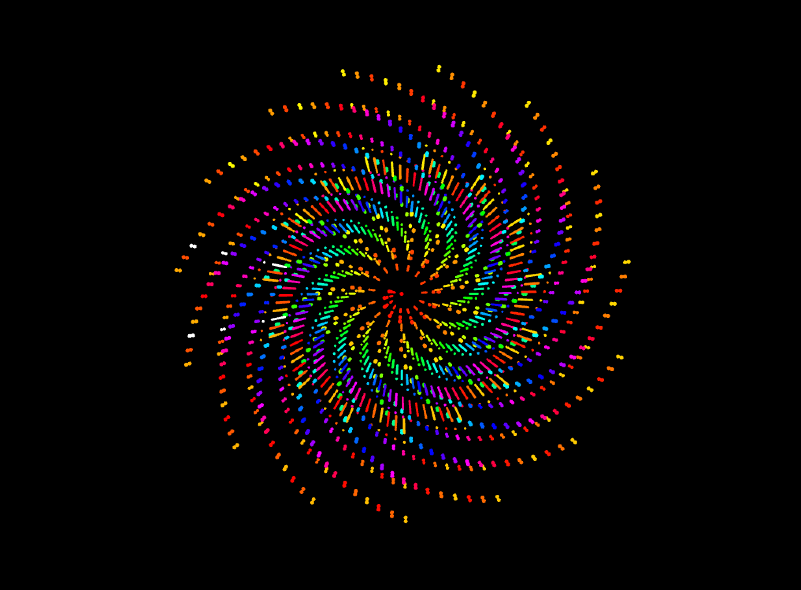
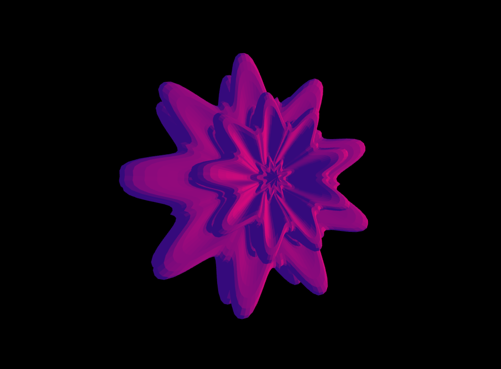
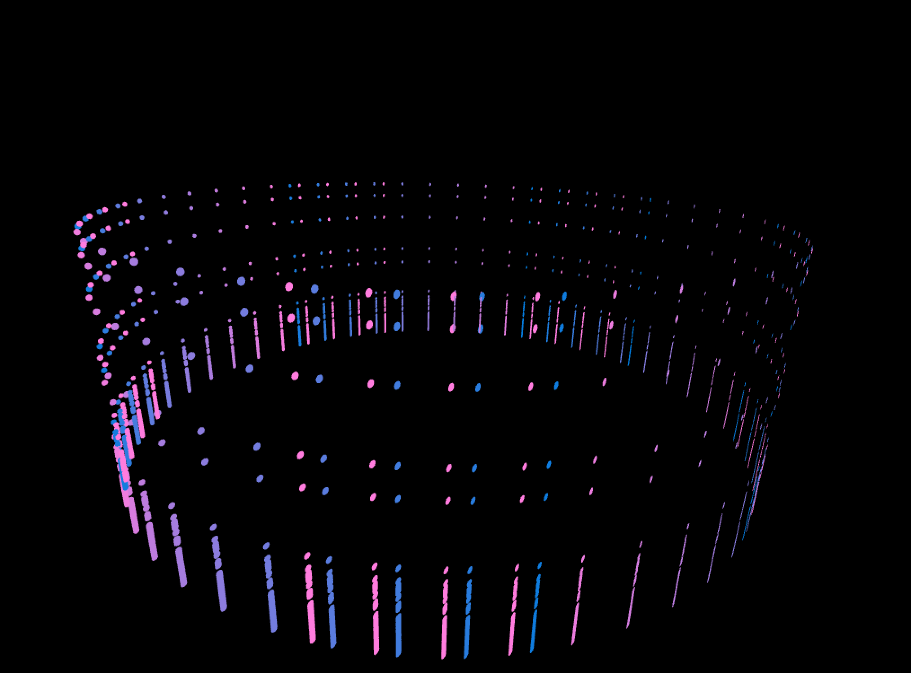

# Audio Visualiser 🎶 🌈

### Description
Inspired by how sounds could be represented visually and how patterns found in nature could be represented mathematically, this interactive audio visualisation aims to explore these two concepts. Written in C++, the program used [openFrameworks](http://openframeworks.cc/download/) to create the mesmerising graphics and [Maximilian](https://github.com/micknoise/Maximilian) music library to extract audio features from audio files using FFT. A interactive GUI is also provided to allow customisation of the shapes. Each visualiser animates in synchronisation with the audio’s magnitudes `myFFT.magnitudes[i]` which contains pitch, amplitude and timbre.

**Phyllotaxis:** a pattern inspired from the natural arrangement of florets of a sunflower. The algorithm was implemented based on Vogel's mathematical formula, where changing angle degrees: 137.3, 137.5 and 137.6 can produce different captivating patterns.
	
**Superformula:** a 3D implementation of superellipses. Superformula is a mathematical formula that can produce many complex shapes and curves found in nature. Simply adjusting the 6 parameters: a, b, m1, m2, n1, n2 and n3 in the GUI to see how various interesting shapes can be made.

**Disco ring:** a simple circular ring, where the points move in y-axis along with the audio, inspired from Sonia's Audible Visuals (link). Created by drawing many ellipses in 360 degrees using sin() and cos() functions, the ring provides a simple yet pleasing to the eyes design in contrast to the previous visualisers which are packed with colours and details.

#### References
- [Algorithmic Botany's Phyllotaxis](http://algorithmicbotany.org/papers/abop/abop-ch4.pdf)
- [Superformula Wikipedia](https://en.wikipedia.org/wiki/Superformula)

### Running the Project
#### Prerequisites
- [Xcode](https://itunes.apple.com/us/app/xcode/id497799835?mt=12) v9.1 
- [openFrameworks](http://openframeworks.cc/download/) v0.9.8
- [Maximilian](https://github.com/micknoise/Maximilian)

#### Instructions
1. Download and install Xcode and openFrameworks.
2. Clone Maximilian.
3. Copy 'ofxMaxim' folder in Maximilian/openFrameworks/ to your openFrameworks/addons/ folder.
4. Open and compile the program in Xcode.
##### GUI Instructions
5. Press 1,2,3 to change visualisers
6. Press 'R' to change Superformula colour
7. Press 5,6 to change audio
8. Press 'G' to show/hide GUI
9. Press 'F' to exit fullscreen
10. Press 'SPACE' to play/pause audio

### Credits:
- [Phyllotaxis tutorial](https://www.youtube.com/watch?v=KWoJgHFYWxY)
- [Audible visuals](https://soniaboller.github.io/audible-visuals/)
- [Superformula3D](https://github.com/kamend/Superformula3d)
- Week 8 FeatureExtractor

openFrameworks' Examples:
- [guiExample](https://github.com/openframeworks/openFrameworks/tree/master/examples/gui/guiExample)
- [colorExample](https://github.com/openframeworks/openFrameworks/tree/master/examples/graphics/colorExample)

Sounds:
- [Piano sample](https://freesound.org/people/Lemoncreme/sounds/186942/)
- [Drum base sample](https://freesound.org/people/Snapper4298/sounds/156680/)

---
Audio-Visual Coursework  
Final Project: Audio Visualiser  
8 January 2018  
Goldsmiths, University of London
